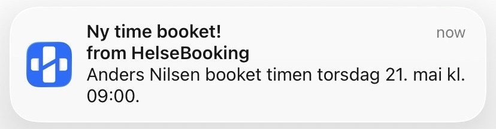

# Velkommen til **HelseBooking**

###  Min fullstack bookingapplikasjon for helsetjenester hvor pasienter kan finne og booke time hos behandlere.

<div align="center">

</div>

De fleste som har forsøkt å booke time i helsebransjen kjenner til eldre systemer, unødvendige steg og brukergrensesnitt som føles utdatert. **HelseBooking** er et fullstack-prosjekt bygget som et svar på nettopp dette, en moderne plattform der pasienter og behandlere samhandler sømløst, med fokus på få klikk fra innlogging til booket time.

Prosjektet demonstrerer ferdigheter innen fullstack webutvikling med MERN-stacken, inkludert JWT-autentisering, rollebasert tilgangskontroll og en moderne brukeropplevelse bygget med React.

## Innhold

- [Live Demo](https://helsebooking.onrender.com)
- [Skjermbilder](#skjermbilder-fra-appen)
- [Logo design](#logo-design)
- [Funksjonalitet](#funksjonalitet)
- [Tech Stack](#tech-stack)
- [Arkitektur](#arkitektur--systemdesign)
- [Installer lokalt](#installer-appen-lokalt)
- [Kontakt](#kontakt)

<div align="center">

<h1><a href="https://helsebooking.onrender.com" target="_blank">Live Demo</a></h1>


</div>

<br>

Jeg har laget testbrukere under man kan logge på med. Med disse er det bare å opprette timer, slette timer, pasienter, behandlere, endre profilbilder og klinikker. **Logg inn og utforsk fritt** — timer og klinikker er forhåndsutfylt.

> [!TIP]
> Appen er responsiv og fungerer på alle enheter, men er optimalisert for mobil (375px – 1000px). For best opplevelse: legg til HelseBooking som PWA på mobilen.
>
> 


### Test-brukere

| Rolle      | Epost                        | Passord   |
|------------|------------------------------|-----------|
| Behandler  | kristoffer@helsebooking.no   | Test1234  |
| Behandler  | lise@helsebooking.no         | Test1234  |
| Behandler  | tove@helsebooking.no         | Test1234  |
| Behandler  | steinar@helsebooking.no      | Test1234  |
| Behandler  | jonas@helsebooking.no        | Test1234  |
| Behandler  | morten@helsebooking.no       | Test1234  |
| Behandler  | kari@helsebooking.no         | Test1234  |
| Pasient    | anders@helsebooking.no       | Test1234  |
| Pasient    | camilla@helsebooking.no      | Test1234  |
| Pasient    | daniel@helsebooking.no       | Test1234  |
| Pasient    | emilie@helsebooking.no       | Test1234  |
| Pasient    | fredrik@helsebooking.no      | Test1234  |
| Pasient    | ingrid@helsebooking.no       | Test1234  |
| Pasient    | marius@helsebooking.no       | Test1234  |

<br>

# Skjermbilder fra appen

Her er noen skjermbilder av appen, men jeg anbefaler at du logger deg på en av testbrukerne å klikker deg rundt selv, eller at vi sammen tar en gjennomgang! 😊


## Forside / Om

<div>
  
  
</div>
<br>
<div>
  
  
</div>

## Auth (login/registrering)
<div>
  
  
</div>

## Book time (pasient)
<div>
  
  
</div>

## Mine timer (pasient)
<div>
  
  
</div>

## Klinikker (behandler)
<div>
  
  
</div>

## 🧑🏻‍⚕️ Min profil (behandler)
<div>
  
  
</div>

<br>

# Logo design

Jeg har lyst til å vise arbeidsprosessen, noen av utkastene og tankegangen som ligger bak logo utviklingen. Som du vil se har noen av utkastene navnet **BehandlerBooking**. Dette var appens "arbeidsnavn" under utviklingen. Ettersom appen utviklet seg og arbeidet med logoen gikk videre ble et navnebytte naturlig. I tillegg ble navnet kortere, beholdt forklarende wordmark, men også mer minneverdig og lettere å bygge en visuell identitet rundt.

## Inspirasjon

Jeg startet med et ønske om en logo som kombinere et ikon med bokstaven B (BehandlerBooking). Så jeg gjorde research og kom over logoen du kan se under. Denne bruker bokstaven B på en elegant måte og ble starten på å finne en egen visuell identitet.


Jeg tok inspirasjonen videre ved å endre logoen til appens farge og legge til et helsekors i enden av B-kurven, som videre ble til en stjerne for bedre flyt. Det var et lite detaljelement som skulle gi logoen personlighet. Dette ble appens midlertidige logo under utvikling. Denne logoen åpnet døren til fire ulike designretninger.

- **Retning 1** - Bokstaven B i logoen
- **Retning 2** - Et symbolsk **Helse Ikon**
- **Retning 3** - Rename av appen til **Helse.**
- **Retning 4** - Moderne, raskt, enkelt og flat-design


## Retning 1 — Bokstaven B (combination mark)

Den første og naturlige retningen logoen tok var fra startpunktet initialen **bokstaven B for BehandlerBooking**. Jeg utforsket alt fra håndskrevne og lekne varianter til geometriske og minimalistiske tolkninger. Det manglet litt helsepreg over logoene, men etter hvert begynte utkastene å bevege seg inn i retning 2, et symbolsk helse ikon.<br><br>
Et utvalg utkast fra retning 1:

<table align="center">
  <tr>
    <td align="center" width="200"></td>
    <td align="center" width="200"></td>
    <td align="center" width="200"></td>
  </tr>
  <tr>
    <td align="center" width="200">B i en B formet hvit bubbly rektangel</td>
    <td align="center" width="200">Negativ B med håndskrevet wordmark</td>
    <td align="center" width="200">Speilet B-form.</td>
  </tr>
  <tr>
    <td align="center" width="200"></td>
    <td align="center" width="200"></td>
    <td align="center" width="200"></td>
  </tr>
  <tr>
    <td align="center" width="200">Forrige logo rotert 90 grader, tegneserie øyne Oo.</td>
    <td align="center" width="200">Minimalistisk wordmark med to overlappende blå firkanter</td>
    <td align="center" width="200">Avrundet ikon med konturene til en speilet B, rotert helsekors, her begynner det å nærme seg neste retning</td>
  </tr>
</table>

<br>

## Retning 2 — Et symbolsk **Helse Ikon**

Med en helseapp var det naturlig å utforske klassiske helse-symboler som helsekorset, hjertet og plasteret. Variantene ble organiske og myke, men kanskje noe generiske. Den siste varianten i denne retningen introduserte helsekorset med en skjult H (HelseBooking) i linjene som kutter helsekorset som vi ser igjen i appens logo.

<table align="center">
  <tr>
    <td align="center" width="200"></td>
    <td align="center" width="200"></td>
    <td align="center" width="200"></td>
  </tr>
  <tr>
    <td align="center" width="200">Minimalistisk og tykt helsekors over wordmark</td>
    <td align="center" width="200">Stjerne med wordmark</td>
    <td align="center" width="200">Helsekors med diagonal bølge</td>
  </tr>
  <tr>
    <td align="center" width="200"></td>
    <td align="center" width="200"></td>
    <td align="center" width="200"></td>
  </tr>
  <tr>
    <td align="center" width="200">Symmetrisk logo, helsekors omgitt av ellipser, tenk kompass</td>
    <td align="center" width="200">Fire overlappende hjerter med gradient</td>
    <td align="center" width="200">Samme hjerte-blomst med wordmark under</td>
  </tr>
  <tr>
    <td align="center" width="200"></td>
  </tr>
  <tr>
    <td align="center" width="200">Helsekors, bygget inn H. Et steg mot ferdig logo.</td>
  </tr>
</table>


<br>

## Retning 3 — Rename appen til **Helse.**

Når jeg startet på disse utkastene var utgangspunktet at det skulle være så enkelt og rent som mulig. Jeg var inspirert av enkle logoer som VIPPS, men for Helse. Jeg vurderte å gi appen et nytt navn og at den kun skulle hete **Helse.** med et punktum som del av logoen.

<table align="center">
  <tr>
    <td align="center" width="200"></td>
    <td align="center" width="200"></td>
  </tr>
  <tr>
    <td align="center" width="200">Helse. med avrundet lys boks rundt "e" og punktum</td>
    <td align="center" width="200">Minimalistisk, kun teksten Helse, med grå prikk som punktum</td>
  </tr>
  <tr>
    <td align="center" width="200"></td>
    <td align="center" width="200"></td>
  </tr>
  <tr>
    <td align="center" width="200">"e" og punktum løftet inn i blå avrundet boks</td>
    <td align="center" width="200">Grønn variant med plaster-ikon til venstre for wordmark</td>
  </tr>
</table>

<br>

## Retning 4 — Moderne, raskt, enkelt og flat-design

Fart og effektivitet ble fokuset i denne retningen, booking skal gå raskt. Få klikk fra du logger inn til riktig time er booket. Startpunktet for denne retningen var en geometrisk "flat-design flamme-logo" jeg oppdaget på Dribbble, som viste seg å være logoen til appen "Fandom" på appstore. Formen inspirerte meg til å utforske flamme og meteor (fart), kombinert med symbolikk for helse.

<table align="center">
  <tr>
    <td align="center" width="200"></td>
    <td align="center" width="200"></td>
    <td align="center" width="200"></td>
  </tr>
  <tr>
    <td align="center" width="200">Flat-design flamme, helsekors og mørk skygge, iOS FANDOM app-ikon stil</td>
    <td align="center" width="200">Flammen med detaljer bak</td>
    <td align="center" width="200">Ikon + wordmark, første gang HelseBooking dukker opp</td>
  </tr>
  <tr>
    <td align="center" width="200"></td>
    <td align="center" width="200"></td>
    <td align="center" width="200"></td>
  </tr>
  <tr>
    <td align="center" width="200">Meteor i fart, helsekors og ios ish ramme</td>
    <td align="center" width="200">Meteor, helsekors og "Helse." wordmarken</td>
    <td align="center" width="200">Meteor med + i app-ikon, wordmark til høyre</td>
  </tr>
  <tr>
    <td align="center" width="200"></td>
    <td align="center" width="200"></td>
    <td align="center" width="200"></td>
  </tr>
  <tr>
    <td align="center" width="200">Samme meteor med orange flamme-detalj integrert i teksten</td>
    <td align="center" width="200">Gult lynikon i avrundet boks med HelseBooking wordmark</td>
    <td align="center" width="200">Flammen som separator mellom "Behandler" og "Booking"</td>
  </tr>
</table>

<br>

## Ferdig logo

Logoen jeg til slutt landet på er en **kombinasjon av de fire retningene** logo utviklingen har vært innom. Jeg tok med meg det jeg likte best fra hver retning og kombinerte det. Fonten er en redigert versjon av Open Sans Bold/Normal.


## Retning 1 - Bokstaven H er en del av ikonet (combination mark)


<br>

## Retning 2 - Et helse ikon/symbol


<br>

## Retning 3 - Punktumet fra "Helse." 


<br>

## Retning - 4 Moderne, men enkelt


<br>

<!-- 
 -->


## Hva jeg liker med denne logoen:

 

 <br>

- Fungerer som en "Badge" uten teksten
- Flyter godt i **navbaren** og på **om** siden i appen
- Kan enkelt kombineres med andre UI elementer
- Fungerer i alle størrelser og farger
- Helse symbolikk i logoen
- Beskrivende wordmark
- Bokstaven "H" er bygget inn i bagde/ikon. Stiltrekk fra grafikken er videreført på bokstavene H og K i teksten med skråstreken
- Moderne og enkel

<br>


## Logo Symbolikk
Helsekorset er et internasjonalt symbol for helse, trygghet og beskyttelse, et umiddelbart gjenkjennelig utgangspunkt. Samtidig består ikonet av flere lag med symbolikk. 

Det vertikale rektangelet i helsekorset symboliserer en pille eller kapsel med delelinje. Det horisontale rektangelet i helsekorset som ligger bak symboliserer behandler og pasient på hver sin side av bordet. Sirkelen med stroke gir helsekorset ro og rammer det inn som noe trygt og helhetlig.

Den diagonale skrålinjen som brukes flere steder i logoen har en oppadgående retning og symboliserer bedring i behandlingsforløpet.

Punktumet i wordmarken bygger videre på ideen fra **Helse.-retningen** og representerer helhet og avslutning, tanken om at plattformen skal være ett samlet sted for behandling, oppfølging og hjelp.

Blåfargen (#006EFF) brukes gjennom hele applikasjonens UI og bidrar til et moderne og helhetlig inntrykk.

<br>

<table align="center">
  <tr>
    <td align="center"></td>
    <td align="center"></td>
  </tr>
  <tr>
    <td align="center">HelseBooking logo blå</td>
    <td align="center">HelseBooking logo grønn</td>
  </tr>
</table>

# Funksjonalitet

### **Pasient**
- Registrering og innlogging med JWT-autentisering
- Sortering av behandlere ved timebestilling etter behandlertype, sorterings knappene for behandler type oppdateres dynamisk etter hvilke typer behandlere som er registrert i appen. 
- Bla gjennom behandlere med Swiper-karusell


- Se behandlerprofiler med profilbilde, navn, beskrivelse og neste ledige time
- Book ledig time med bekreftelsesmodal med utvidet timeinformasjon
- Se og avbestille egne timer med swipe-to-delete animasjon som revealer animerteikoner som reagerer på draglengde ved swipe
- Se utvidet time informasjon under mine timer ved å klikke på en time, med behandler kontaktinformasjon og veibeskrivelse til klinikken tilknyttet timen


<br>

## **Behandler**
- Opprette ledige timer med dato, klinikk og tidspunkt
- Se oversikt over bookede timer i kalender
- Rollebasert visning – behandlere ser andre verktøy enn pasienter
- Laste opp og slette profilbilde via Cloudinary
- Rediger alle felter i profilen samt behandler beskrivelse og type
- Opprett og rediger klinikker og tilhørende behandlere til klinikken
- Fly over animasjon ved endring av klinikkens plassering:


- Rediger timer, legg til eller fjern pasienter på timen.
- Aktivere push varsling for booking og avlysing av timer.



- Behandlere på **Om**-siden roterer og viser et tilfeldig utvalg ved hver lasting

<br>

## **Generelt**
- Rollebasert tilgangskontroll (pasient / behandler / admin)
- Hindrer at samme time bookes flere ganger
- Det er ikke mulig å booke eller opprette timer tilbake i tid
- Timer blir slettet dersom man fjerner en behandler fra en klinikk
- Timer blir slettet dersom man sletter profilen (pasient/behandler)
- Responsivt design med animert navigasjon

<br>

# Tech Stack

### Frontend
| Teknologi          | Bruk                           | Begrunnelse                                      |
|---                 |---                             |---                                               |
| React + Vite       | UI-rammeverk og byggverktøy    | Rask utviklingsopplevelse                        |
| React Router v7    | Klientside routing             | Industristandard for React SPA                   |
| Zustand            | Global state management        | Enklere API enn Redux, ingen boilerplate         |
| Framer Motion      | Animasjoner og swipe-to-delete | Animasjon med god React-integrasjon              |
| Swiper             | Karusell for behandleroversikt | Touch-vennlig og mobil-optimalisert              |
| Axios              | HTTP-kall mot API              | Enklere enn fetch og god feilhåndtering          |
| Lucide React       | Ikonbibliotek                  | Fine, lette og konsistente ikoner + treeshakable |
| Leaflet + Geoapify | Kart og adressesøk             | Open source, ingen kostnad og enkel integrasjon  |

### Backend
| Teknologi           | Bruk                            | Begrunnelse                                         |
|---                  |---                              |---                                                  |
| Node.js + Express   | API-server                      | Samme språk som frontend, stort økosystem           |
| MongoDB + Mongoose  | Database og ODM                 | Fleksibel modellering og enkel skalering            |
| JWT + bcryptjs      | Autentisering og passordhashing | Stateless auth, ingen server-side sessions          |
| Cloudinary + Multer | Bildeopplasting og lagring      | CDN-optimalisert bildelagring med transformasjoner  |
| CORS                | Kryssdomene-tilgang             | Nødvendig for separat frontend/backend deploy       |

### Deploy
| Tjeneste         | Bruk                                                       | Begrunnelse                           |
|---               |---                                                         |---                                    |
| Render           | Hosting av frontend og backend                             | Gratis tier, enkel GitHub-integrasjon |
| MongoDB Atlas    | Skybasert database                                         | Gratis tier, enkel oppsett            |
| Cloudinary       | Bildelagring                                               | Gratis tier med CDN                   |
| Google Analytics | Brukertrafikk og besøksstatistikk                          | Gratis tier, enkel integrasjon        |

<br>

# Arkitektur / systemdesign

Dette prosjektet er bygget som et rollebasert bookingsystem der kjernen i systemet er samspillet mellom brukere, klinikker og timeavtaler.

Systemet er designet rundt tre hovedentiteter:

- Brukere (User)
- Klinikker (Klinikk)
- Timer (Time)


## Brukere og roller

Systemet har tre roller:

- Pasient – kan velge behandler og booke tilgjengelige timer
- Behandler – kan opprette tilgjengelige timer og administrere egne pasienter på sine timer
- Admin – kan administrere systemets struktur (klinikker, brukere og relasjoner) (funksjon kommer)

Brukere lagres i en felles User-modell, der rollen bestemmer tilgangsnivå og funksjonalitet i UI og API.

Behandlere har i tillegg utvidet profil med:

- fagfelt (typeBehandler)
- profilinformasjon
- profilbilde (Cloudinary)

<br>


## Klinikker som “hub”

Klinikker fungerer som et organisatorisk lag mellom behandlere og timer.

En Klinikk inneholder:

- navn og adresse
- geografiske koordinater (Leaflet/Geoapify)
- liste over tilknyttede behandlere
- eier (opprettetAv)

Dette gjør at en behandler kan tilhøre flere klinikker, og klinikker kan skaleres uavhengig av brukere.

<br>


## Time-modellen (kjerne i systemet)

Time er den mest sentrale modellen i systemet og binder det hele sammen.

En time inneholder:

- behandler (reference til User)
- pasient (valgfri frem til booking)
- klinikk
- dato + start/slutt-tid
- status: ledig | booket | avlyst

Systemet er bygget rundt time states:

- ledig → booket (pasient reserverer)
- booket → ledig (avlysning)
- opprettet → tilgjengelig slot fra behandler

Dette gir en tydelig og kontrollert livssyklus for hver time.

<br>


## Backend regler

Backend håndhever all forretningslogikk:

- Overlappende timer blokkeres på server (ingen dobbeltbooking)
- Tid i fortid kan ikke opprettes
- Kun tilgjengelige timer kan bookes
- Avlysning frigjør timer automatisk
- Sletting av klinikk eller bruker rydder relaterte data (cascade-logikk)

## Autentisering og tilgang
- JWT brukes for autentisering
- Middleware beskytter private routes
- Rollebasert tilgang styrer:
  - Hvem som kan opprette timer
  - Hvem som kan booke
  - Hvem som kan administrere klinikker

## Designvalg
- MongoDB ble valgt for fleksibel modellering av relasjoner
- Mongoose brukes til validering og relasjonslogikk
- Backend håndterer validering (ikke frontend)
- Frontend er kun presentasjonslag + state management
- API er REST-basert og delt mellom frontend/backend (separate deploys)

## Mappestruktur:

```
HelseBooking/
├── backend/
│   └── src/
│       ├── controllers/
│       ├── middleware/
│       ├── models/
│       ├── routes/
│       └── server.js
└── frontend/
    └── src/
        ├── components/
        ├── pages/
        ├── store/
        └── main.jsx
```

Som nevnt, så er frontend og backend er deployet som to separate services på Render(.com) og kommuniserer via REST API.

<br>

## Installer appen lokalt

### Forutsetninger
- Node.js
- MongoDB Atlas-konto
- Cloudinary-konto

### Installasjon

```bash
# Klon repoet
git clone https://github.com/patriklie/HelseBooking.git

# Installer backend
cd HelseBooking/backend
npm install

# Installer frontend
cd ../frontend
npm install
```

### Miljøvariabler

Opprett `.env` i `backend/`-mappen:

```
MONGO_URI=din_mongodb_connection_string
JWT_SECRET=din_hemmelige_nøkkel
CLOUDINARY_URL=din_cloudinary_url
PORT=3000
NODE_ENV=development
```

Opprett `.env` i `frontend/`-mappen:

```
VITE_API_URL=http://localhost:3000
VITE_GEOAPIFY_API_KEY=din_geoapify_nøkkel
```

### Start applikasjonen

```bash
# Start backend (fra backend-mappen)
npm run dev

# Start frontend (fra frontend-mappen)
npm run dev
```
<br>

## Kontakt

**Patrik Bystrøm Lie**
- GitHub: [@patriklie](https://github.com/patriklie)
- E-post: [patrik.lie@hotmail.com](mailto:patrik.lie@hotmail.com)

<br>

## Kreditering

Dette prosjektet bruker tredjepartsillustrasjoner og verktøy:

- Freepik – illustrasjons figurene du ser rundt om i appen
- Leaflet – kartvisning
- Geoapify – kartdata

<a href="https://www.magnific.com/free-psd/3d-female-character-with-superhero-cape-launching-into-flight_13678512.htm">Link til Freepik illustrasjoner</a>